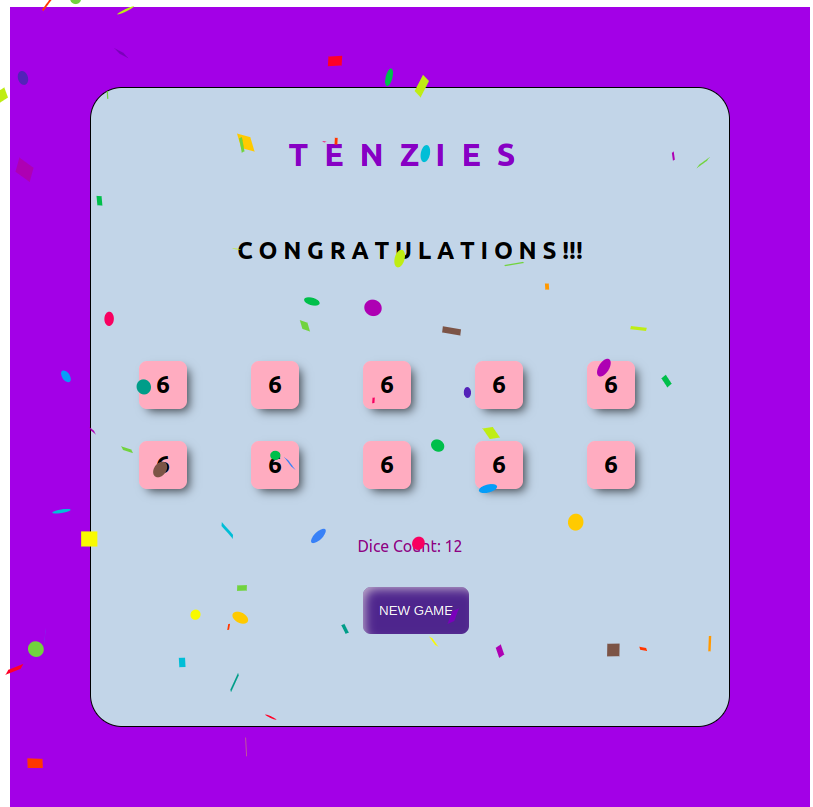

# Tenzies Game (freecodecamp)

## Link

- Live Site URL: [https://harshita1225.github.io/tenzies-game/](https://harshita1225.github.io/tenzies-game/)

## Overview

### The challenge

- build a block of 10 random numbers

- set a roll button to change the random number

- button to hold the values

- declare winner and conffite to be displayed

#### Desktop Version

- Tenzies game
  

- Tenzies game
  
- Tenzies game
  

### Built with

- Semantic HTML5 markup
- React (useState, useEffect)
- Javascript
- CSS
- Flex box

## Author

- Website - [Harshita Joshi-Github](https://github.com/harshita1225)
